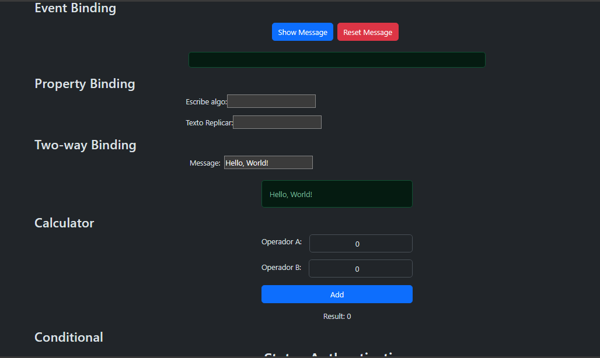
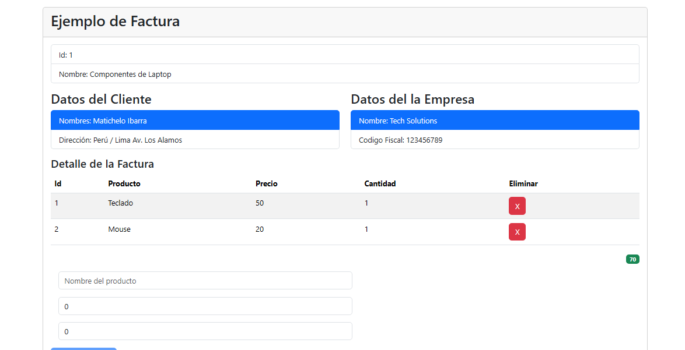

# Introduccion in Angular 18v
- What is Angular? : Angular is a platform and framework for building single-page client applications using HTML and TypeScript. Angular is written in TypeScript. It implements core and optional functionality as a set of TypeScript libraries that you import into your apps.

### Name Project App-Angular

 
<em>Examples of codes from the new version of Angular.</em>

### Name Project Invoice-App

 
<em>Example of an invoice system.</em>

### Name Project Cart-App

 
<em>Example of an invoice system.</em>

